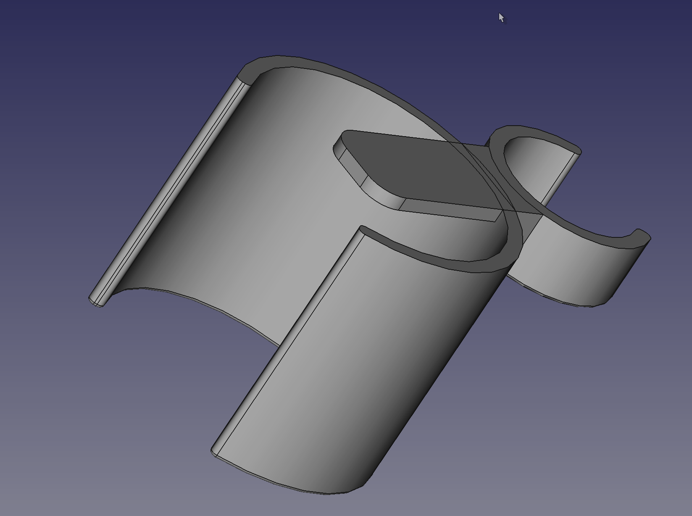
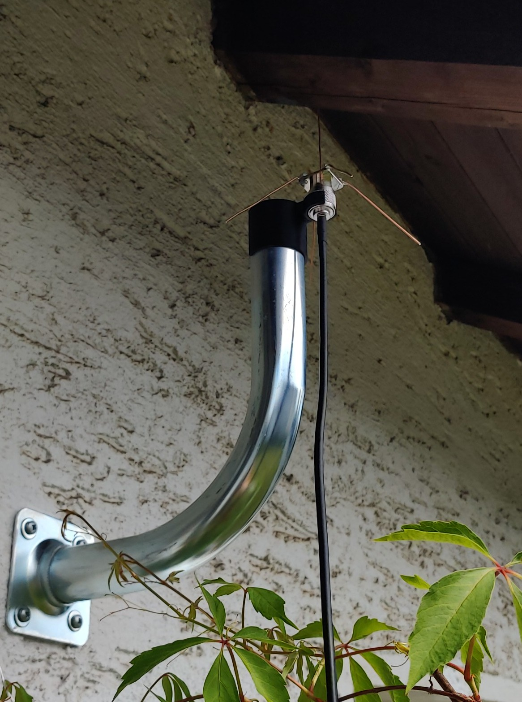
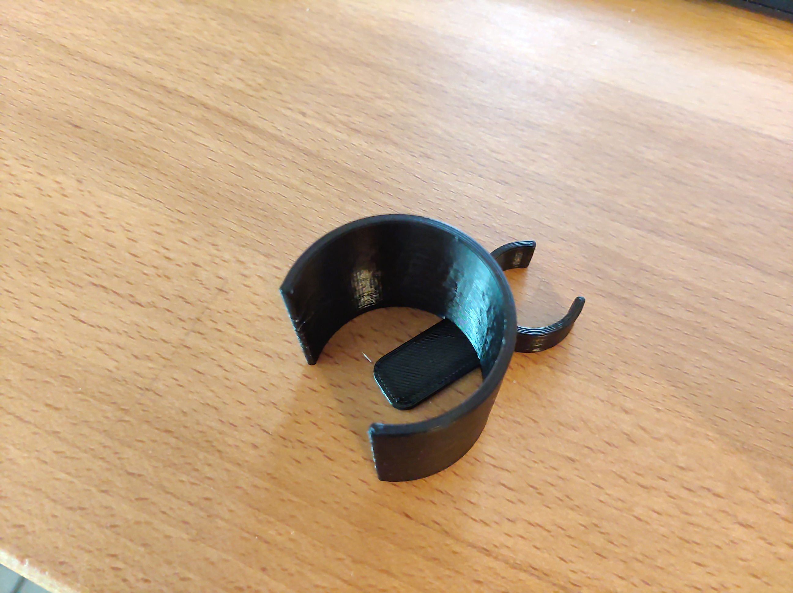
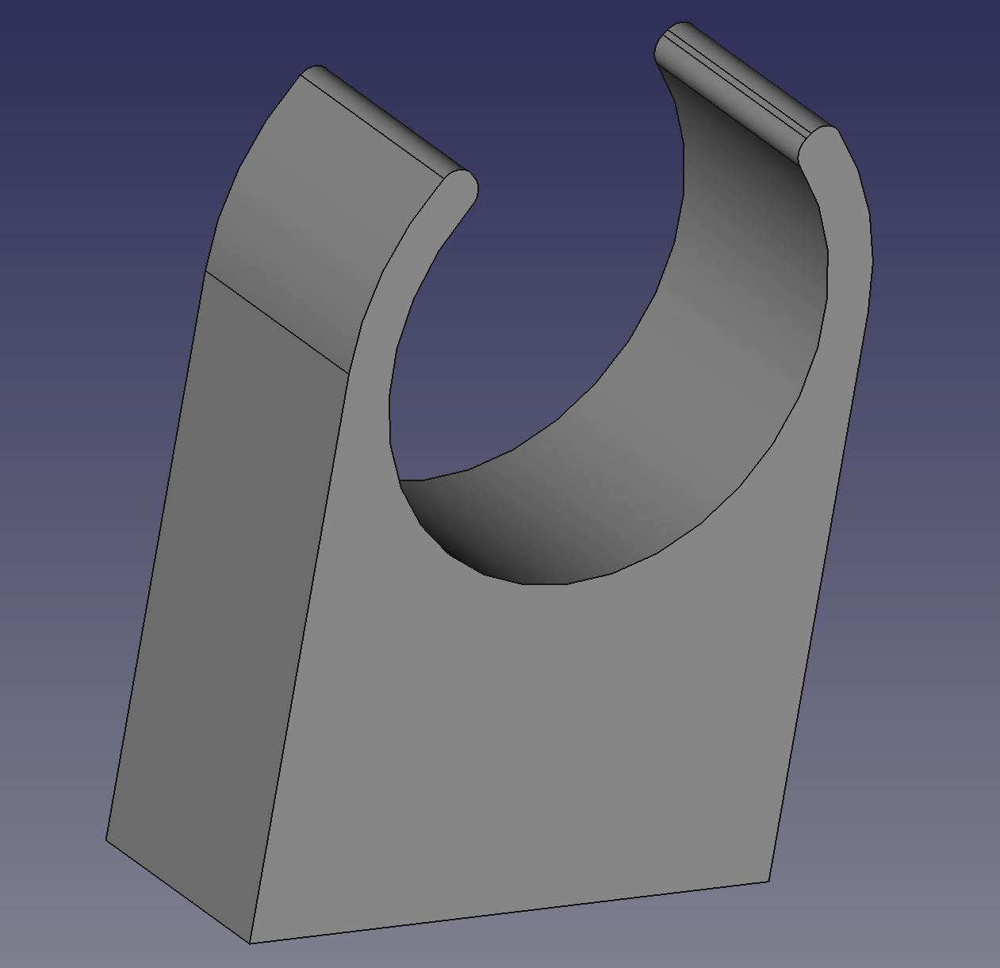
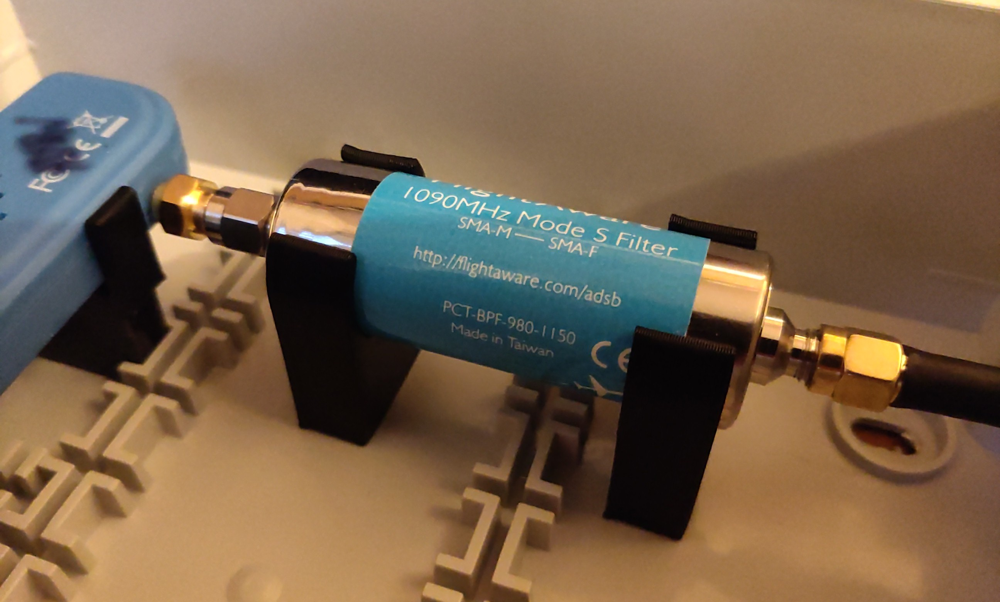
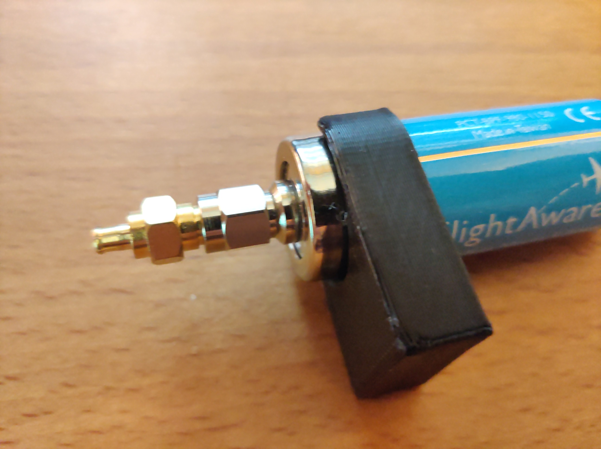
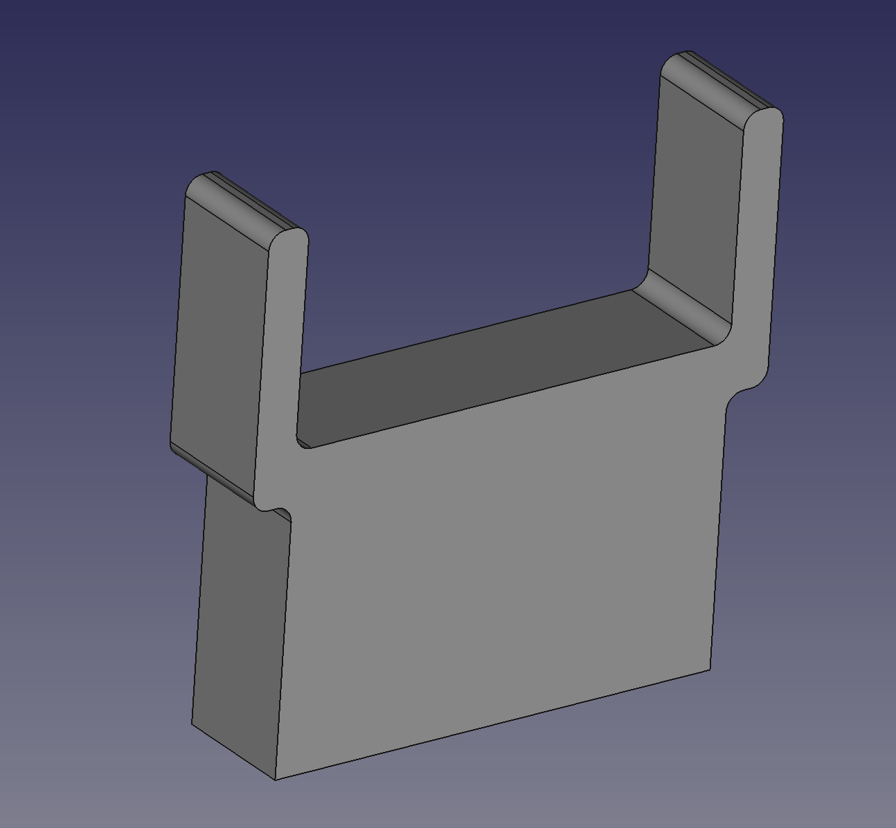
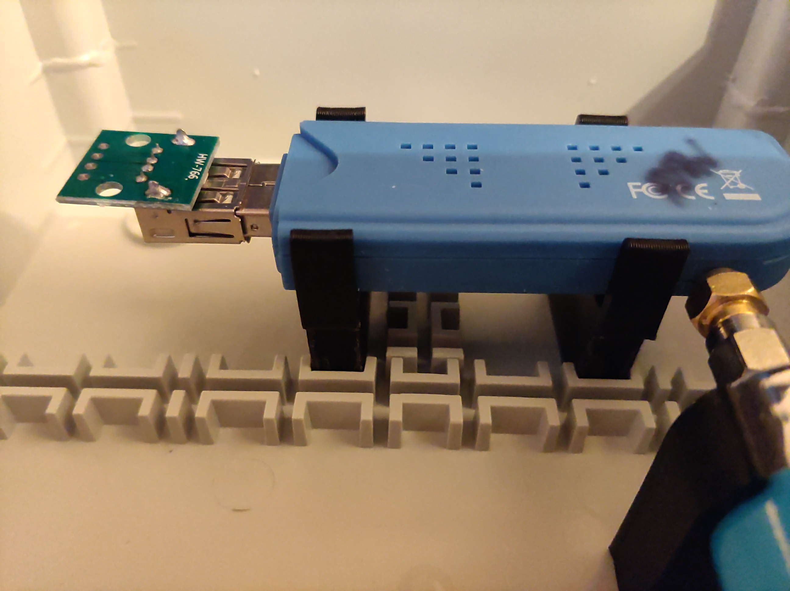
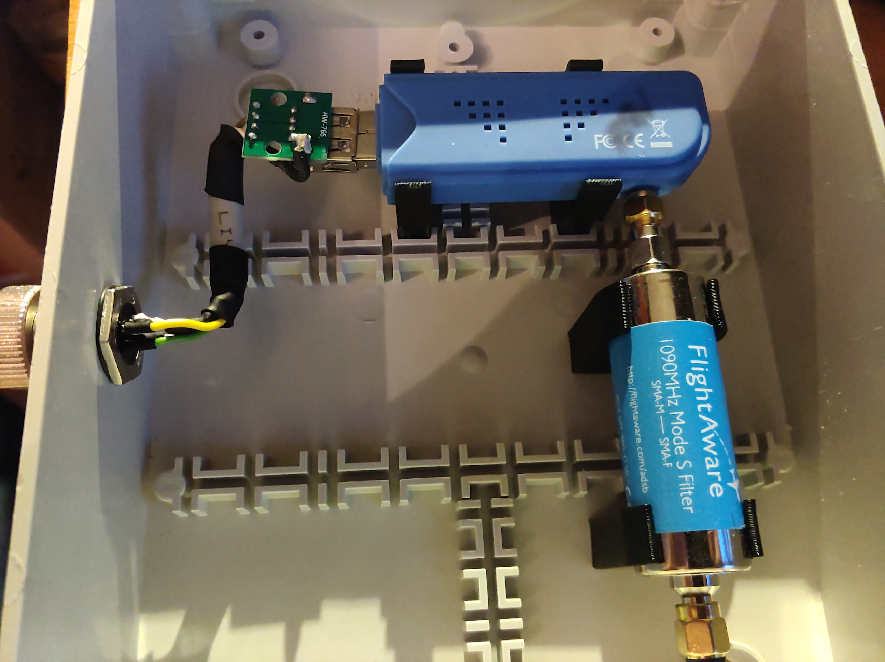

# Halter und Ständer zum selber ausdrucken

Ein paar Halter und Ständer die man mit seinem 3D-Drucker selber ausdrucken kann.

## Antenna mast bracket

Ich habe es in PLA ausgedruckt, es sollte aber besser in einem Filament gedruckt werden, welches UV beständiger ist.
Auf der einen Seite kann man den N-Stecker einklipsen und die andere Seite auf dem Antennenmast stecken.

## Filter stand

Ein Ständer um den Filter in einem Gehäuse fest zu montieren. Designt ist er für den FlightAware Bandpass Filter.

## USB Stick stand

Ein Ständer für einen DVB-T USB-Stick, wenn er maximal 27mm breit und 13mm hoch ist, dann sollte der Ständer passen. Ansonsten kann man in der FreeCAD Projektdatei sich den Halter auch anpassen.

Mehr Bilder im Unterordner **images**
