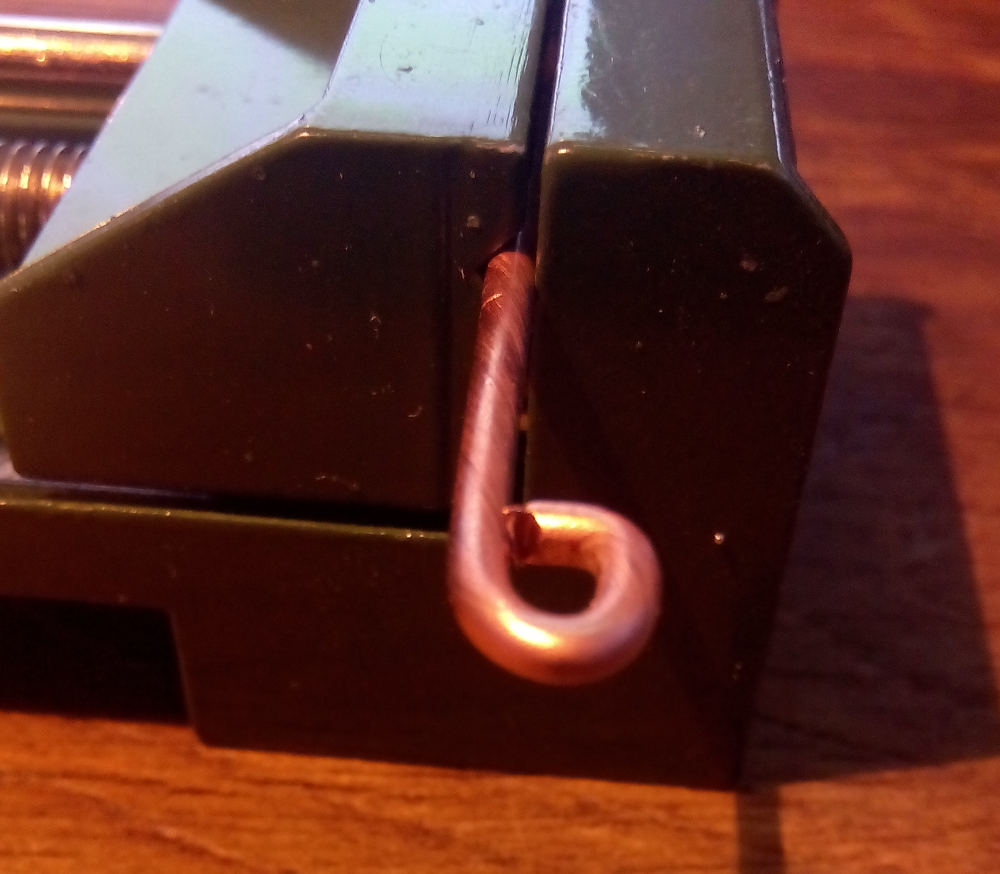
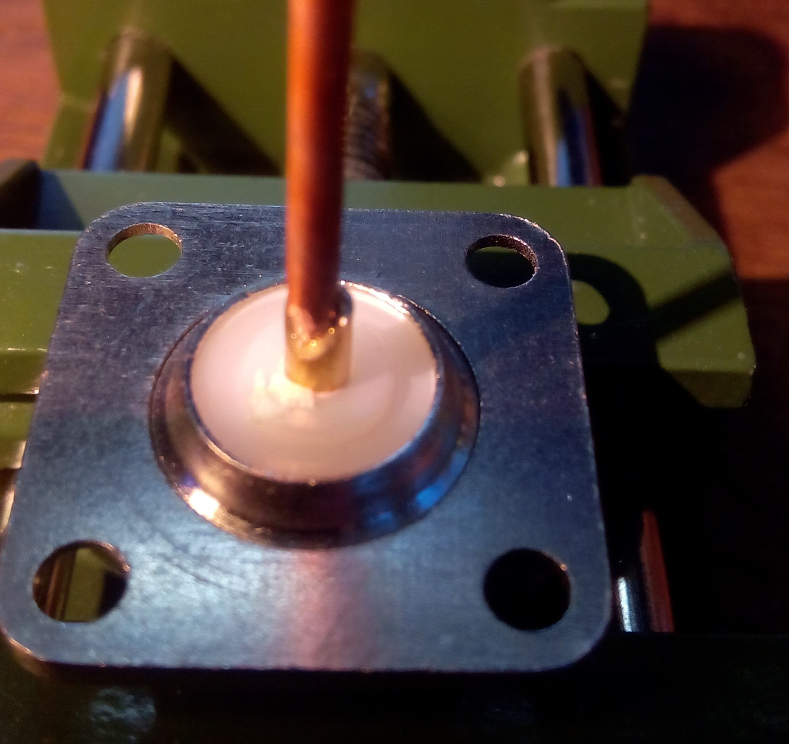
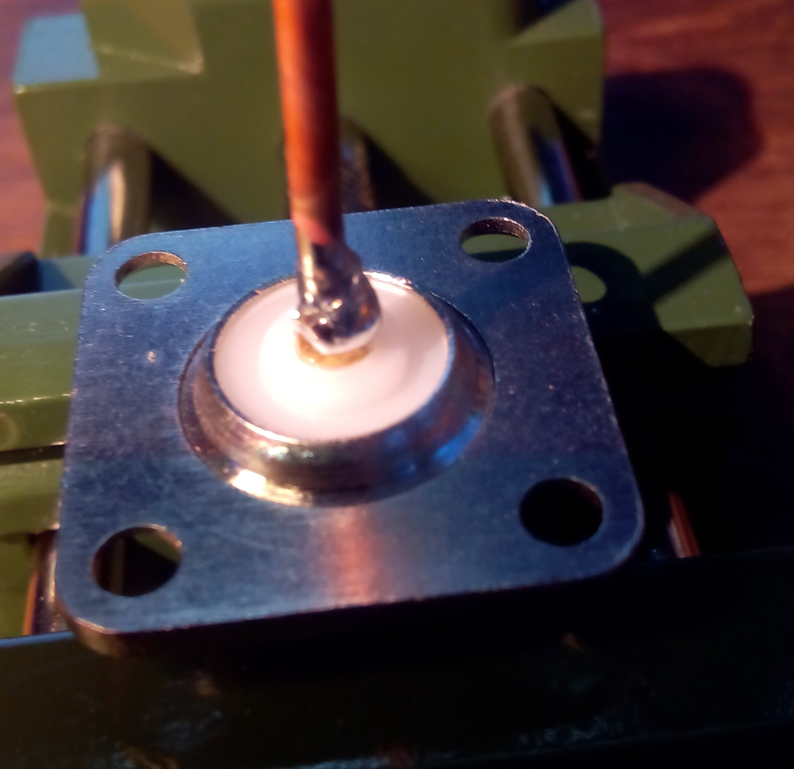
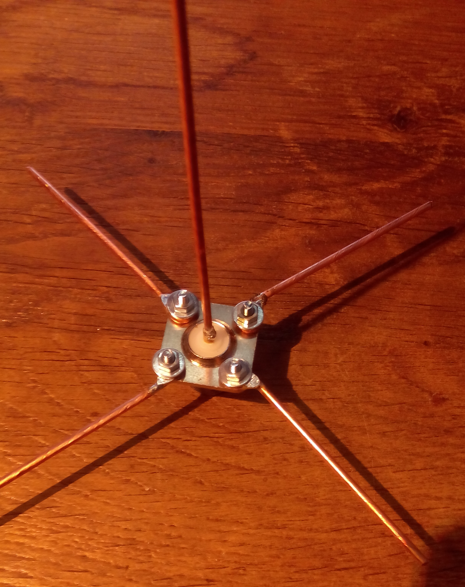
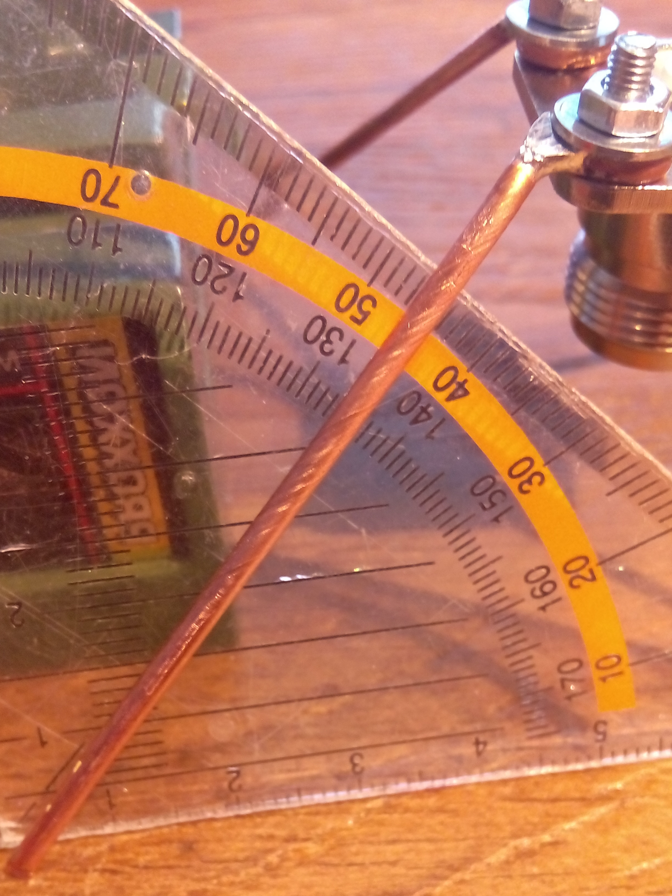

# Antennas for ADS-B reception
There are different Antennas on the market cheap ones as well as expensive ones. Some perform very decently while other models are not working at all.
We like to bild our own antennas which should be:
* Cheap to build
* Easy to build
* Small so installation is not an issue
* Long range

## The groundplane
The groundplane ist very cheap to make and is a decent performer when build to spec.
### Whats good
* Cheap (roughly 5€ without cable)
* Easy to build
* Good reception

### Whats not so good
* Looks homemade
* Fragile when transported, not so much when installed
* You may need a VNA to tune it to the optimal performance

### Parts needed
* N socket
* 40cm copper wire (1.5mm² or better 2.5mm²)
* 4 M3 bolts and nuts (you may want to add washers)
* SMA -> N RG58 cable to connect it to your bandpassfilter an rtl_sdr (length depends on your setup, the shorter the better, we usualy use 1m)

### Tools needed
* Soldering iron + solder
* Wrench for the M3 nuts or Pliers
* Wirecutter
* Screwdriver for the M3 screws

### Building the Antenna
cut 4 about 8cm long copper pieces and create a loop on each end which is big enoug for a M3 screw

solder the loops end for mor stability

cut one 8cm long copper piece

and solder it into the antenna jacks middle pin

screw the four pieces withe the loops to the antenna at an 45° angle

and bend them down 45°

Connect the antenna and install it in an upright position with clear line of sight

## The pcb antenna
The pcb antenna is a readily available pcb you find online from China. We build an enclosure to make it waterproof and add mounting brackets

### Whats good
* No soldering required
* Already tuned to frequency
* Very robust (good for traveling or harsh conditions)
* Looks quite professional
* Excellent performance

### Whats not so good
* A bit more expensive than the groundplane (roughly 20€ without cable)
* If you do not want to drill a big hole for the SMA connector in the bottom you need to crimp your own sma cable after passing it trough the endcap

### Parts needed
* PCB Antenna (search for ADS-B 1090MHz ANT V1.0)
* 30cm of 25mm diameter plastic tube (cable installation tube works great and is cheap)
* 13.8cm of 16mm diameter plastic tube (cable installation tube works great and is cheap)
* 2 plastic endcaps for 25mm diameter (chair leg caps work great)
* 2 1/2" or 22mm conduit clamps mit m8 mounting thread
* 2 conduit claps according to your mounting pole
* 2 3cm long m8 threaded rods (you can use threaded rod cut to length or m8 screws from which you cut off the head)
* sma to sma cable as long as you need, the shorter the better (we use rg58 and crimp our connectors after feeding the cable trough the endcap)

### Tools needed
* Screwdriver for tightening down the clamps (often a size 2 pozidriv)
* Hacksaw with metal cutting blade

### Building the antenna
* Cut your 25mm diameter tube to 30cm
* Cut your 16mm diameter tube to 13,8cm
* Drill a hole in the center of one endcap, choose your drillbit size big enough to feed your sma cable trough
* Feed cable trough endcap and put cap on tube (can use some glue but not needed)
* Pull the cable trough the 25mm diameter tube ande the 16mm tube
* Screw the sma connector to the antenna
* the smaller tube will sit inside the bigger tube to prevent the pcb antenna from sliding down
* pull everything carefully into the tube until the pcb sticks out about 1-2mm
* Put the other endcap on top no hole and no glue here, so you can access the antenna lateron for repairs
* Mount the 22mm conduit clamp on the lower end of the tube 2mm from the endcap with the cablefeed
* Mount the second 22mm clamp a bit higher on the tube in the same direction (stay in the area where there is no pcb to avoid interference with the antenna. 5cm clamp to clamp distance is fine)
* Connect each of the other two conduit clams with a threaded m8 rod with the clamps on the antenna
* Mount the thing on your mounting pole
